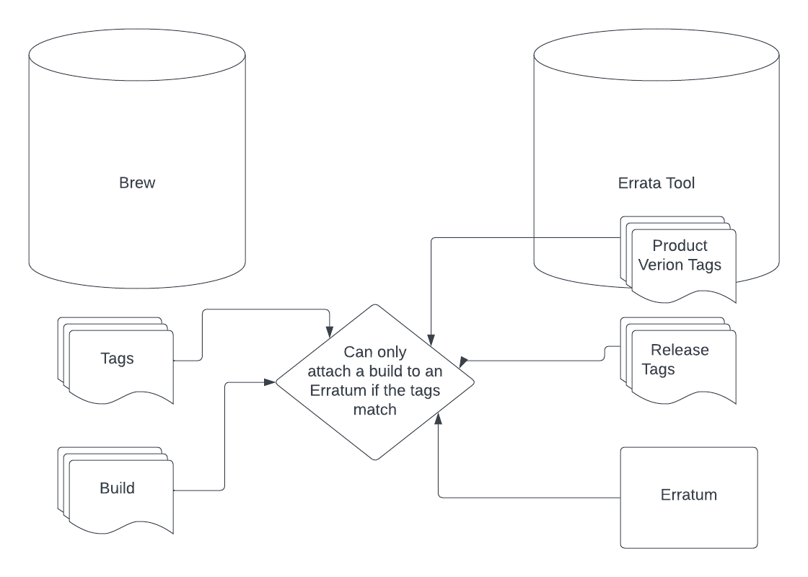

# Integration with Product Definitions

If using the community version of Component Registry there is an local version of Product Definitions shipped with the 
repository. Component Registry uses it to build it's Product hierarchy. Here's a tanslation of terms from Product 
Definitions to Component Registry models:

* ps_product: Product
* ps_module: ProductVersion
* ps_update_stream: ProductStream

Component Registry uses the following attributes of ps_update_streams to discover what should be manifested:

* errata_info
* brew_tags
* composes
* yum_repositories

Where's it's possible to provide errata_info that is preferred method for Component Registry as it allows a direct 
mapping between ps_update_stream and Errata Tool Product Version. Composes are useful for upcoming and GA RHEL content,
yum_repositories and brew_tags are the least preferred method because they don't provide a clear link to Errata Tool 
product taxonomy.

If brew_tags are used Component Registry does some data matching between the brew_tags defined in Product Definitions
with those discovered in Errata Tool. The brew tags are modified in the following ways before looking for exact matches:

1. -candidate is stripped from Errata Tool brew_tags
2. -candidate and -released are stripped from Product Definition brew_tags
3. -container-released is stripped from Product Definitions brew_tags

Once a match is found all the Variant children of the matching Errata Tool Product Version are recorded in the 
"variants_from_brew_tags" meta_attr of the corresponding ProductStream. We also use these "variants_from_brew_tags" 
to associate CPE information with the ProductStream. 

Component Registry does not associate all builds with a ProductVersion's brew_tags to Product Streams. 
We don't do that because it leads to extraneous builds being associated with the ProductStream. That occurs because
brew_tags in Errata Tool are used as a gate for what *can* be attached to an Erratum for a ProductVersion (or Release), 
not to define what builds make up the ProductVersion. The builds for what makes up the ProductVersion can be calculated
using the builds with the brew tags in combination with the builds which were actually released to the matching variants instead.

## Adding CPEs to Product Stream SBOMs

In order for customer to [match vulnerability data from VEX files to SBOMs](https://www.redhat.com/en/blog/future-red-hat-security-data)
generated by Component Registry, we need to include a list of CPEs in each SBOM.  We include CPEs from Errata Tool 
variants matched using either errata_info, or brew_tags as mentioned above. We override some stream CPEs where good 
matching is not possible, see `corgi/core/fixups.py`.

Where a Product Stream uses brew_tags for matching we also include CPEs matching uses patterns. Product Definitions
can include CPE values for a ps_module. We use those values in combination with the versions from ps_update_streams to find
matches, see `tests/test_products.py` for some examples. When generating an SBOM for a brew_tag stream (which doesn't 
specify errata_info) we use both the CPEs from matching Variants and CPEs from matching patterns.

